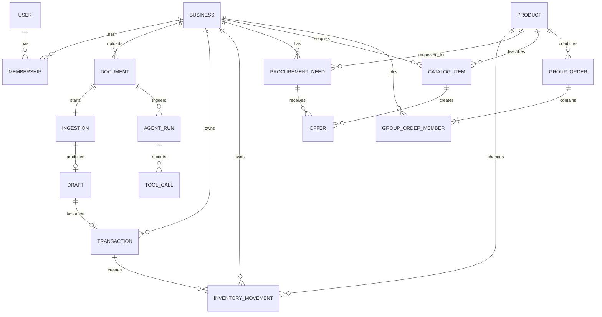
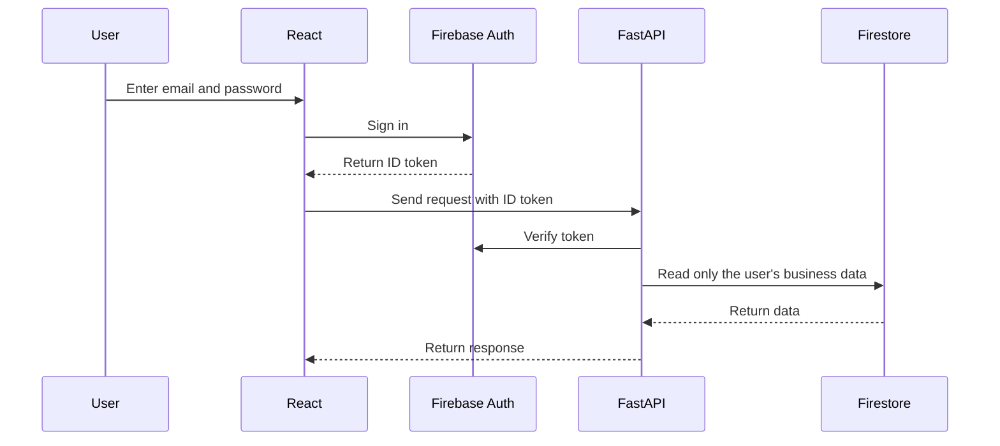
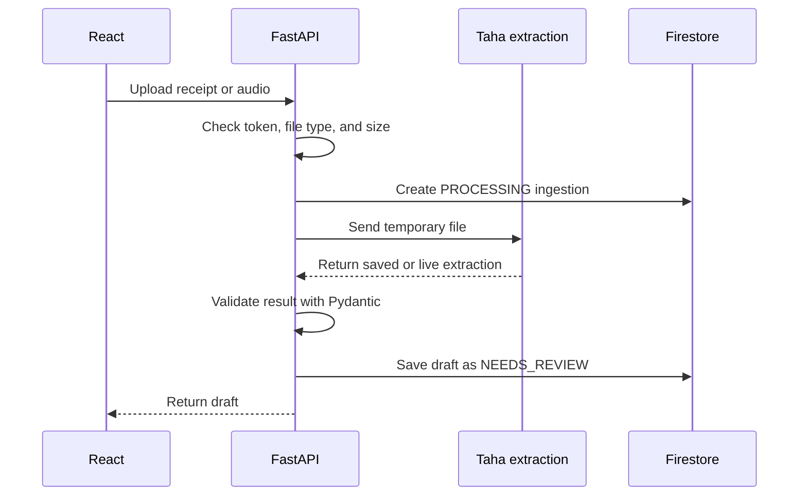
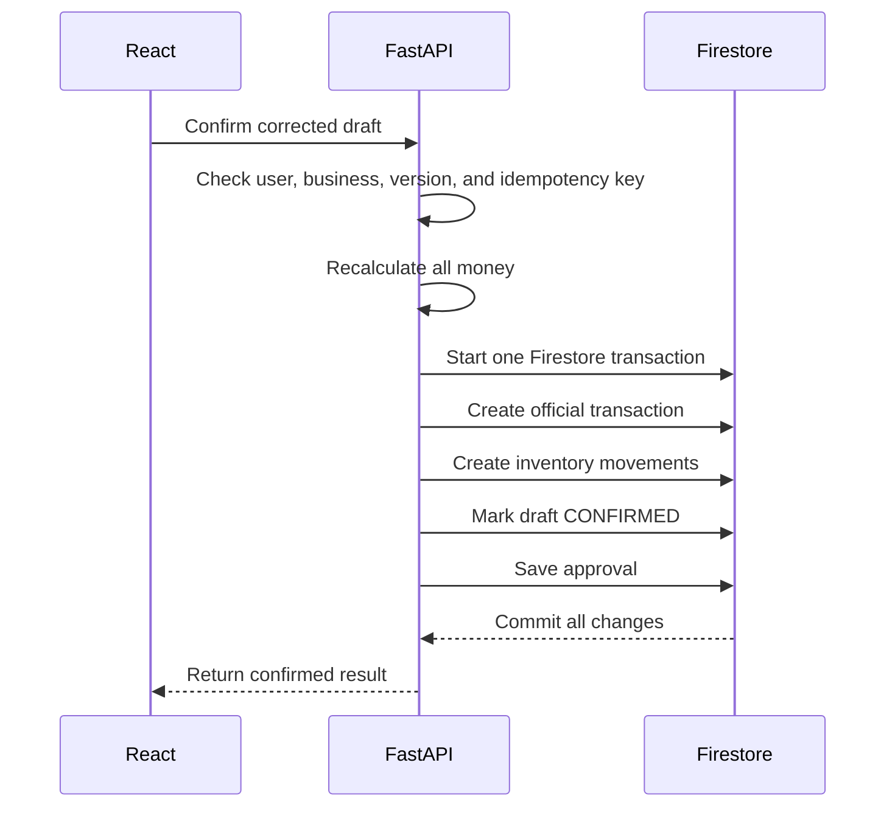

# Anas backend guide

This guide explains Anas's work in simple English.

He does not need to build the whole backend at once. His first goal is one
small working flow:

```text
Upload a receipt
        ↓
Get a draft from Taha's saved example
        ↓
Show the draft
        ↓
Confirm it once
        ↓
Create a transaction and update stock
```

Anas can start this flow before the real Gemma connection and final Firebase
data are ready.

## 1. What Anas is building

Anas is building the FastAPI server.

The server sits between the website, Firebase, and Taha's AI work.

```text
React website
        ↓
FastAPI server
        ↓
Firebase
```

FastAPI also calls Taha's Python functions:

```text
FastAPI
        ↓
Taha's extraction or procurement function
        ↓
FastAPI checks the result
        ↓
Firebase stores the approved data
```

### What FastAPI must do

- Receive requests from React.
- Check the user's Firebase login token.
- Find the user's business and role.
- Reject users who try to read another business's data.
- Validate uploaded files.
- Call Taha's extraction function.
- Save unconfirmed results as drafts.
- Confirm a draft only after the user clicks confirm.
- Create transactions and stock movements.
- Return dashboard, transaction, and inventory data.

### What FastAPI must never do

- Trust a business ID sent by the browser.
- Let Gemma write confirmed records.
- Change stock before the user confirms a draft.
- Calculate money with floating-point numbers.
- Create the same transaction twice.

## 2. Who owns each part

| Person | Owns |
|---|---|
| Anas | FastAPI routes, schemas, business logic, Firebase access from Python, and backend tests |
| Asttr0 | Firebase setup, Firestore paths, security rules, API decisions, and frontend integration |
| Taha | Gemma extraction, saved AI results, forecasts, supplier comparison, and group-order calculations |
| Rabii | Supplier screens and shared UI components |
| Aymen | Deployment checks, demo reset checks, QA, and demo reliability |

Anas does not own the Firebase project setup or Gemma prompts.

## 3. What MCD means

MCD means **Modèle Conceptuel de Données**.

It is a map of the important data in the product and how the data connects.
It is not SQL code and it is not Firestore code.

## 4. MCD for MIZAN Souq



## 5. What each data object means

| Object | Simple meaning | Important information |
|---|---|---|
| User | A person who signs in | User ID, email, name |
| Business | A merchant or supplier organization | Business ID, type, name, city |
| Membership | Connects a user to a business | User ID, business ID, role |
| Product | A standard product identity | Product ID, name, category, unit |
| Document | Information about an uploaded file | File name, type, size, business ID |
| Ingestion | Tracks the extraction work | Status, document ID, error |
| Draft | Unconfirmed information from extraction | Lines, total, uncertainty, question |
| Transaction | A confirmed sale, purchase, or expense | Type, total, date, business ID |
| Inventory movement | A stock increase or decrease | Product, quantity, direction |
| Procurement need | A product the merchant should reorder | Product, quantity, stockout date |
| Catalog item | A supplier's product and price | Product, price, minimum quantity |
| Offer | A supplier's answer to a purchasing need | Price, delivery, total cost |
| Group order | One combined purchase | Product, total quantity, deadline |
| Group-order member | One merchant's part of the group order | Business, quantity, status |
| Approval | Proof that a person approved an action | User, action, date |
| Agent run | One Gemma extraction or reasoning run | Provider, status, date |
| Tool call | One tool used during an agent run | Tool name, order, result |

## 6. Main relationships

- A user joins a business through a membership.
- A business uploads a document.
- A document starts an ingestion.
- An ingestion produces a draft.
- A draft becomes a transaction only after confirmation.
- A confirmed transaction creates inventory movements.
- Inventory movements change product stock.
- A procurement need can receive several supplier offers.
- Several businesses can join one group order.
- One agent run contains several tool calls.

## 7. Firestore paths

Asttr0 owns the final Firestore design. This is the starting layout that Anas
should use when designing repository methods:

```text
profiles/{user_id}

products/{product_id}

organizations/{organization_id}
  memberships/{user_id}
  inventory_items/{product_id}
  documents/{document_id}
  ingestion_jobs/{ingestion_id}
  extraction_drafts/{draft_id}
  transactions/{transaction_id}
  inventory_movements/{movement_id}
  procurement_needs/{need_id}
  supplier_catalog_items/{item_id}
  offers/{offer_id}
  approvals/{approval_id}
  agent_runs/{agent_run_id}
    tool_calls/{tool_call_id}

group_orders/{group_order_id}
  members/{member_id}

supplier_opportunities/{opportunity_id}
```

The code calls a business an `organization`.

Draft lines can be stored inside the draft document for the MVP. Transaction
lines can also be stored inside the transaction document.

The full field-level contract is in
[the database guide](database-guide.md). That guide is the source of truth if a
short example in this handoff is incomplete.

## 8. Important backend rules

### Rule 1: get the business from the login

React sends:

```text
Authorization: Bearer <firebase_id_token>
```

FastAPI verifies this token.

FastAPI then gets:

```text
user_id
organization_id
role
```

Never trust this:

```json
{
  "organization_id": "some-other-business"
}
```

The browser must not choose which business it can access.

### Rule 2: drafts are not official records

A draft can be edited or rejected.

A draft must not change:

- Sales.
- Expenses.
- Profit.
- Cash.
- Inventory.

Only confirmation creates official records.

### Rule 3: use centimes for money

Do not store money as a float.

```text
18.50 MAD = 1850 centimes
22.00 MAD = 2200 centimes
```

Use fields such as:

```text
unit_price_centimes
total_centimes
delivery_fee_centimes
```

This prevents rounding mistakes.

### Rule 4: confirmation must happen once

React sends an `Idempotency-Key` when confirming.

If React sends the same request again, FastAPI returns the first result instead
of creating another transaction.

### Rule 5: AI results are untrusted

FastAPI validates Taha's result with Pydantic.

Gemma can create a draft. It cannot:

- Confirm a draft.
- Create an official transaction.
- Change inventory.
- Approve an order.

### Rule 6: do not keep uploaded files in the cloud

Cloud Storage is disabled.

FastAPI should:

1. Receive the file.
2. Check its size and type.
3. Send it to the extraction function.
4. Save only metadata and the draft.
5. Delete the temporary file data.

## 9. Login flow



Use:

- `401` when the token is missing or invalid.
- `403` when the user is signed in but does not have permission.
- `404` when a business-owned record does not exist or belongs to another
  business.

Returning `404` hides the existence of another business's record.

## 10. Upload and extraction flow



### Ingestion states

```text
PROCESSING
    ├── NEEDS_REVIEW
    │       ├── CONFIRMED
    │       └── REJECTED
    └── FAILED
```

The draft contains the clarification question. The user corrects the uncertain
field on the review screen and sends the corrected draft during confirmation.

## 11. Confirmation flow



All database changes must succeed together.

If one write fails, none of the confirmation writes should remain.

## 12. Dashboard flow

```text
React asks for dashboard
        ↓
FastAPI verifies the user
        ↓
FastAPI reads confirmed records only
        ↓
Python calculates totals
        ↓
FastAPI returns KPIs, alerts, and the next action
```

## 13. First API endpoints

Anas should start with these three endpoints.

### Upload evidence

```text
POST /api/v1/ingestions
```

Request:

```text
Content-Type: multipart/form-data
Authorization: Bearer <token>

file: <receipt or audio>
kind: receipt | audio | ledger | screenshot
```

Simple response:

```json
{
  "id": "ing_001",
  "status": "NEEDS_REVIEW",
  "document": {
    "id": "doc_001",
    "kind": "receipt",
    "original_name": "receipt.jpg",
    "content_type": "image/jpeg",
    "size_bytes": 245821
  },
  "draft": {
    "id": "draft_001",
    "version": 1,
    "transaction_kind": "purchase",
    "currency": "MAD",
    "lines": [
      {
        "line_id": "line_001",
        "product_id": "cooking_oil_1l",
        "product_name": "Cooking oil 1L",
        "quantity": 20,
        "unit_price_centimes": 2200,
        "line_total_centimes": 44000,
        "confidence": 0.72,
        "uncertain_fields": ["quantity"]
      }
    ],
    "total_centimes": 44000,
    "clarification_question": "Was the quantity 20 units?"
  }
}
```

Important errors:

| Status | Meaning |
|---:|---|
| `401` | Login token is missing or invalid |
| `413` | File is too large |
| `415` | File type is not allowed |
| `422` | Extraction data is invalid |
| `503` | Live extraction and backup extraction both failed |

### Read an ingestion

```text
GET /api/v1/ingestions/{id}
```

This returns the current status and draft.

It returns `404` if the ingestion does not exist or belongs to another
business.

### Confirm a draft

```text
POST /api/v1/ingestions/{id}/confirm
```

Headers:

```text
Authorization: Bearer <token>
Idempotency-Key: <unique value>
```

Simple request:

```json
{
  "draft_version": 1,
  "clarification_answers": [
    {
      "field_path": "lines[0].quantity",
      "answer": "20"
    }
  ],
  "draft": {
    "transaction_kind": "purchase",
    "lines": [
      {
        "line_id": "line_001",
        "product_id": "cooking_oil_1l",
        "quantity": 20,
        "unit_price_centimes": 2200
      }
    ]
  }
}
```

Simple response:

```json
{
  "ingestion_id": "ing_001",
  "draft_id": "draft_001",
  "transaction_id": "txn_001",
  "inventory_movement_ids": ["mov_001"],
  "status": "CONFIRMED",
  "total_centimes": 44000
}
```

Return `409 Conflict` if:

- The draft is already confirmed.
- The draft version is old.
- The same idempotency key is used with different data.

## 14. Business-data endpoints

After the three ingestion endpoints work, Anas builds:

```text
GET /api/v1/transactions
GET /api/v1/inventory
GET /api/v1/merchant/dashboard
```

### Transactions response

```json
{
  "items": [
    {
      "id": "txn_001",
      "kind": "purchase",
      "total_centimes": 44000,
      "occurred_at": "2026-07-24T10:00:00Z"
    }
  ],
  "next_cursor": null
}
```

### Inventory response

```json
{
  "items": [
    {
      "product_id": "cooking_oil_1l",
      "name": "Cooking oil 1L",
      "quantity_on_hand": 35,
      "low_stock": true,
      "predicted_stockout_at": "2026-07-28T00:00:00Z"
    }
  ]
}
```

### Dashboard response

```json
{
  "kpis": {
    "sales_centimes": 1250000,
    "expenses_centimes": 830000,
    "estimated_profit_centimes": 420000,
    "available_cash_centimes": 610000
  },
  "inventory": {
    "product_count": 18,
    "low_stock_count": 1
  },
  "alerts": [
    {
      "code": "stockout_soon",
      "message": "Cooking oil may run out in four days."
    }
  ],
  "next_action": {
    "code": "review_procurement_need",
    "label": "Review a safe reorder of 20 units",
    "target_id": "need_001"
  }
}
```

## 15. Later procurement endpoints

Anas builds the HTTP routes. Taha provides the calculations.

| Endpoint | Anas does | Taha does |
|---|---|---|
| `POST /procurement-needs/generate` | Check user, save and return result | Calculate stockout and reorder |
| `GET /procurement-needs` | Read the business's needs | — |
| `GET /suppliers/search` | Return an API response | Match suppliers |
| `POST /offers/compare` | Validate request and return response | Rank offers |
| `POST /group-orders/propose` | Check user and save proposal | Match demand and calculate savings |
| `POST /group-orders/{id}/join` | Check user and update member status | — |
| `POST /group-orders/{id}/approve` | Save the approval once | — |
| `GET /supplier/dashboard` | Return supplier data | Provide demand results if needed |
| `GET /supplier/opportunities` | Return safe aggregated demand | Provide aggregation inputs |
| `POST /supplier/offers` | Check supplier and save offer | — |
| `GET /agent-runs/{id}` | Return the audit timeline | Provide agent and tool-call data |

Do not start these endpoints before upload, review, and confirmation work.

## 16. What Anas receives from Taha

Taha's side of this handoff is documented in
[the AI and procurement guide](taha-ai-procurement-handoff.md).

Anas calls one function:

```text
extract_evidence(
  file_bytes,
  content_type,
  evidence_kind,
  organization_context
)
```

It returns the draft shape shown above.

Taha can use:

- Real Gemma.
- The saved demo answer.

Anas should not care which one was used. Both must return the same fields.

If Taha's function is not ready, Anas uses a temporary saved JSON result.

Anas must not call Gemini directly inside a FastAPI route.

## 17. Recommended backend folders

```text
apps/api/app/
  core/
    config.py
    firebase.py

  modules/
    auth/
      dependencies.py
      schemas.py

    ingestion/
      router.py
      schemas.py
      service.py
      repository.py

    transactions/
      router.py
      schemas.py
      service.py
      repository.py

    inventory/
      router.py
      schemas.py
      service.py
      repository.py

    businesses/
      router.py
      schemas.py
      service.py

  tests/
    ingestion/
    transactions/
    inventory/
```

Simple meaning:

| File | Purpose |
|---|---|
| `router.py` | Receives HTTP requests and returns responses |
| `schemas.py` | Defines Pydantic request and response shapes |
| `service.py` | Contains the business flow |
| `repository.py` | Reads and writes Firestore |
| `dependencies.py` | Checks login and permissions |

Do not put the complete business flow inside `router.py`.

## 18. What Anas should do first

### Create his branch

```bash
git switch main
git pull --ff-only origin main
git switch -c feat/18-ingestion-api
```

### First small delivery

1. Create the authentication-context Pydantic model.
2. Use a development-only fake logged-in user.
3. Create the ingestion request and response schemas.
4. Create the three ingestion routes.
5. Use an in-memory repository.
6. Return Taha's saved JSON example.
7. Test upload, read, confirm, repeated confirm, and wrong-business access.
8. Open a draft pull request.

This does not need the final Firestore repository or live Gemma.

### Second delivery

After Asttr0 freezes the Firestore paths and API contract:

1. Replace the in-memory repository with Firestore.
2. Verify real Firebase ID tokens.
3. Confirm drafts using one Firestore transaction.
4. Add transaction, inventory, and dashboard routes.
5. Test organization isolation and idempotency.

## 19. When Anas should ask the team

Anas should ask instead of guessing when:

- A required field is missing.
- A product can use a fractional quantity.
- A dashboard calculation is unclear.
- Taha's result does not match the Pydantic schema.
- A Firestore path is different.
- React needs a field that the API does not return.
- A role needs new permission.

Record final answers in GitHub issue #12, #18, or #19.
