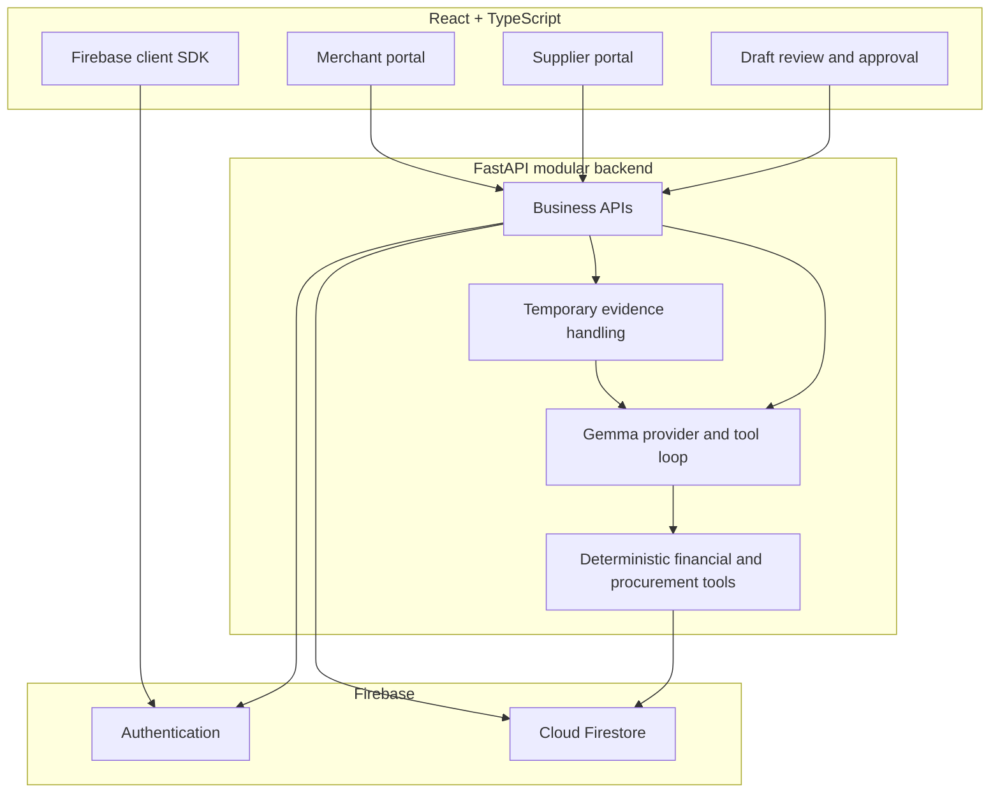

# Architecture

## Decision

GemmaPunks is a modular monolith: one React web app, one FastAPI backend, and one
Firebase project.



## Authority boundaries

- React presents state, gathers evidence, and asks for confirmation.
- Firebase Authentication creates the client ID token.
- FastAPI verifies the token and owns authoritative business operations.
- Gemma structures evidence, identifies uncertainty, chooses approved tools, and
  explains recommendations.
- Deterministic Python calculates totals, margins, affordability, stockout
  forecasts, rankings, and savings.
- Firestore stores confirmed records, drafts, approvals, and audit history.
- FastAPI validates evidence, processes it temporarily, and discards the file
  after extraction; Firestore keeps its metadata and audit status.
- Humans confirm financial records and approve group-order participation.

## Firestore topology

```text
system/schema
profiles/{user_id}
products/{product_id}
organizations/{organization_id}
  memberships/{user_id}
  inventory_items/{product_id}
  transactions/{transaction_id}
  inventory_movements/{movement_id}
  documents/{document_id}
  ingestion_jobs/{job_id}
  extraction_drafts/{draft_id}
  supplier_catalog_items/{item_id}
  procurement_needs/{need_id}
  offers/{offer_id}
  approvals/{approval_id}
  agent_runs/{run_id}
    tool_calls/{tool_call_id}
group_orders/{group_order_id}
  members/{organization_id}
supplier_opportunities/{opportunity_id}
```

Business documents carry `organization_id` even when nested. The backend checks
membership and organization equality before reads and writes. Supplier
opportunities contain aggregated demand only. Canonical products are top-level
so inventory, catalogs, procurement needs, and collective orders share one
product identity. Cross-organization group orders are top-level and server-only.

The exact field contracts and access matrix are defined in
[the database guide](database-guide.md).

## Failure mode

`FixtureProvider` implements the same interface as `GemmaApiProvider`. The demo
can switch to deterministic fixture output with `AI_PROVIDER=fixture`; financial
and procurement calculations never change provider.
