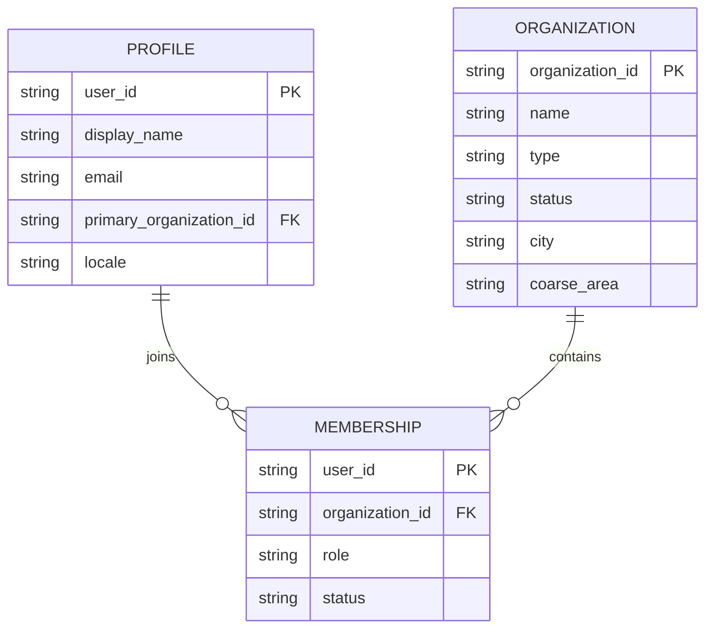
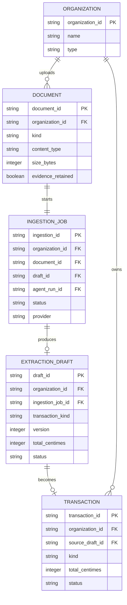
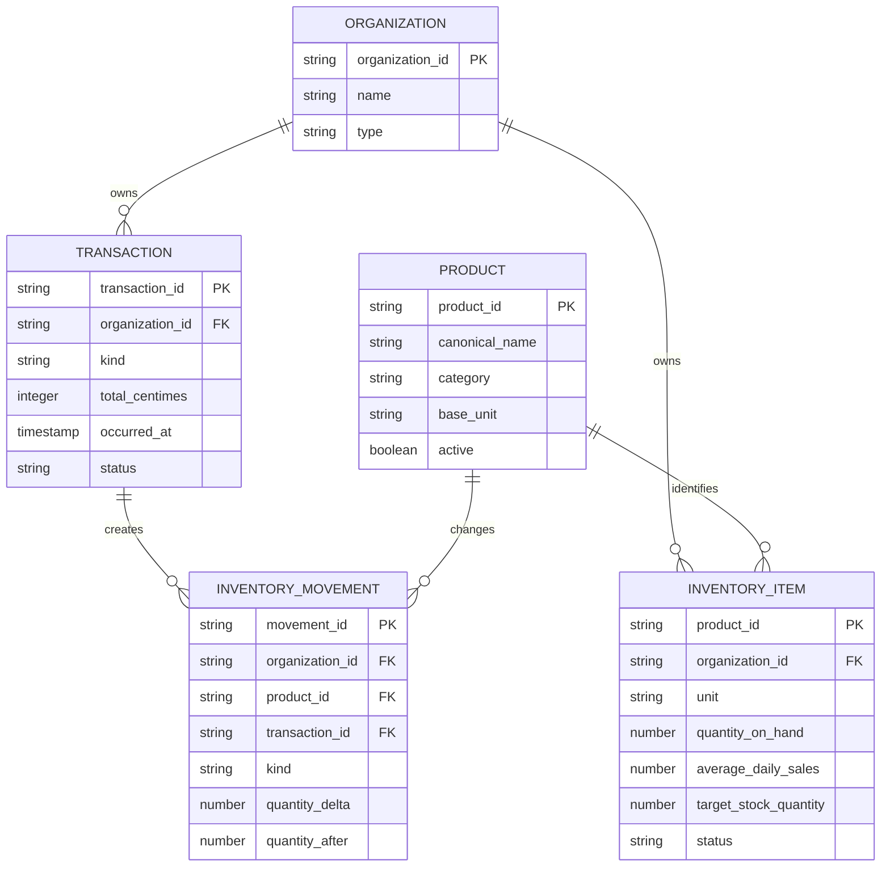
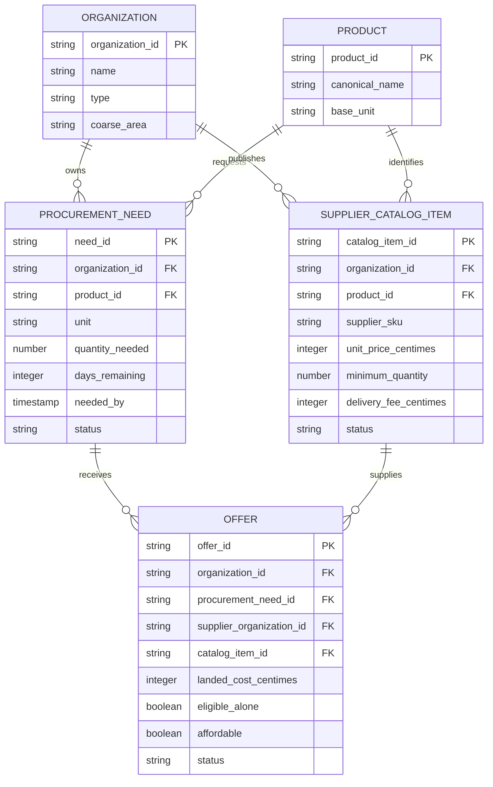
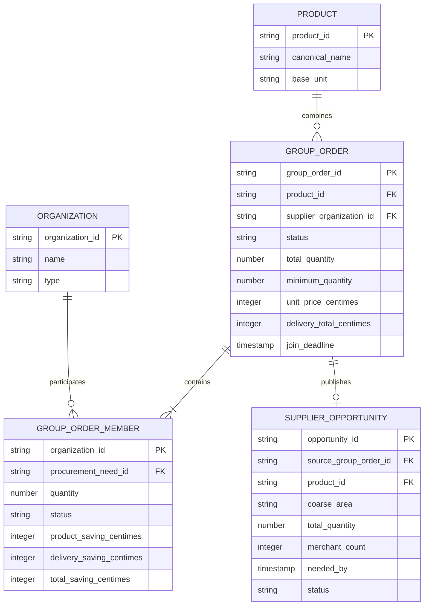
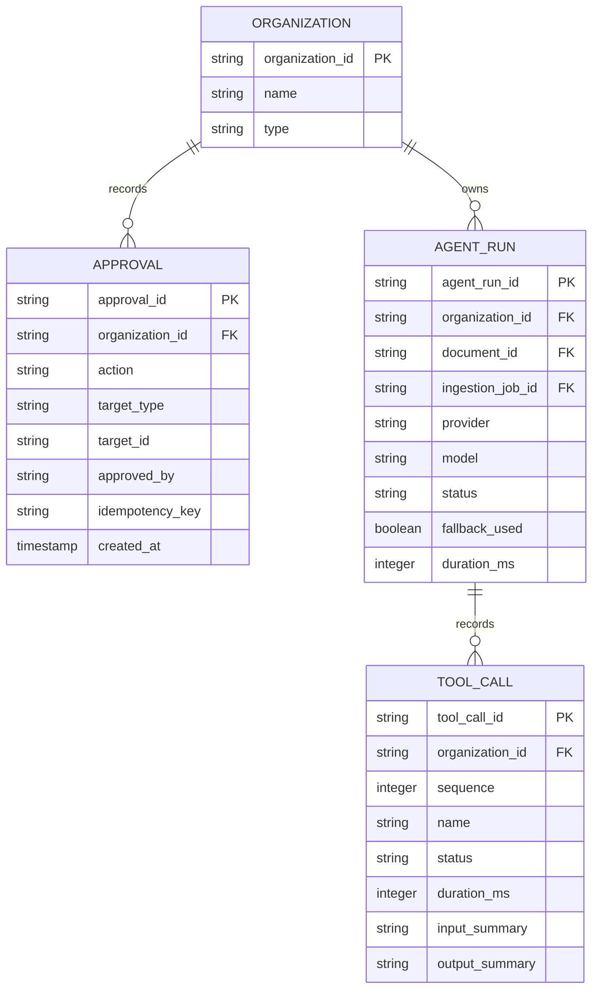

# MIZAN Souq database guide

This is the shared database contract for the hackathon. Read it before creating
a Firebase collection, changing a field name, or saving business data.

```text
Firebase Auth proves who the user is
        ↓
The ID token contains the user's organization ID
        ↓
FastAPI verifies the token and active membership
        ↓
FastAPI performs every official write
        ↓
Firestore stores organization-isolated records
```

## 1. Five database rules

1. Every private business record is stored below its organization.
2. Every organization child document also contains `organization_id`.
3. Money is stored as integer centimes, never as a floating-point MAD value.
4. React can read allowed data, but FastAPI performs every official write.
5. Gemma creates drafts and recommendations; it never confirms a record.

MIZAN Souq uses Firebase Authentication, Cloud Firestore, and the local Firebase
Emulator Suite. Cloud Storage is disabled for P0. FastAPI processes receipt and
audio binaries temporarily and discards them.

## 2. Complete Firestore tree

```text
system/
  schema

profiles/
  {user_id}

products/
  {product_id}

organizations/
  {organization_id}
    memberships/
      {user_id}
    inventory_items/
      {product_id}
    documents/
      {document_id}
    ingestion_jobs/
      {ingestion_id}
    extraction_drafts/
      {draft_id}
    transactions/
      {transaction_id}
    inventory_movements/
      {movement_id}
    supplier_catalog_items/
      {catalog_item_id}
    procurement_needs/
      {need_id}
    offers/
      {offer_id}
    approvals/
      {approval_id}
    agent_runs/
      {agent_run_id}
        tool_calls/
          {tool_call_id}

group_orders/
  {group_order_id}
    members/
      {organization_id}

supplier_opportunities/
  {opportunity_id}
```

This tree is the source of truth. Do not create alternative paths such as
`users/{user_id}/transactions` or `merchant_data/{organization_id}`.

## 3. Why three collections are top-level

### Canonical products

`products` gives merchants and suppliers one identity for the same product.

```text
huile 1l
oil 1 litre
زيت 1 لتر
        ↓
products/cooking-oil-1l
```

The business's stock is separate:

```text
organizations/{organization_id}/inventory_items/{product_id}
```

### Group orders

A group order spans several merchant organizations, so it cannot live below
one merchant. Stored group-order documents are server-only because they contain
participant organization IDs. FastAPI returns a filtered view to each user.

### Supplier opportunities

`supplier_opportunities` is a safe aggregated demand view. It may contain a
product, total quantity, merchant count, coarse area, and deadline.

It must never contain merchant names, exact addresses, sales, revenue, profit,
available cash, or customer information.

## 4. Identity and membership

For P0, one user has one primary organization. Their Firebase ID token contains:

```json
{
  "organization_id": "merchant-berrechid",
  "role": "OWNER"
}
```

Roles are `OWNER`, `MEMBER`, or `ADMIN`. Organization types are `MERCHANT` or
`SUPPLIER`.

The token claim enables scoped client reads. The membership document remains
the backend source of truth:

```text
organizations/{organization_id}/memberships/{user_id}
```

FastAPI verifies both the token and active membership. React never chooses a
trusted organization ID in a request body.

## 5. Shared field rules

### IDs

Use stable lowercase kebab-case IDs such as:

```text
merchant-berrechid
cooking-oil-1l
need-oil-001
```

Relationships use IDs, never display names.

### Money

Every authoritative money field ends with `_centimes`:

```text
18.50 MAD = 1850 centimes
22.00 MAD = 2200 centimes
```

Use `unit_price_centimes`, `line_total_centimes`,
`delivery_fee_centimes`, `landed_cost_centimes`, and
`total_saving_centimes`. Never store `unit_price_mad: 18.5`.

### Quantities

A quantity always has an explicit unit:

```json
{
  "quantity": 20,
  "unit": "BOTTLE"
}
```

P0 units include `BOTTLE`, `BAG`, `UNIT`, `BOX`, `KILOGRAM`, and `LITRE`.

### Dates and statuses

Dates are Firestore Timestamp values. Common names are `created_at`,
`updated_at`, `occurred_at`, `needed_by`, `stockout_at`, `join_deadline`, and
`approved_at`.

Statuses use uppercase values such as `ACTIVE`, `PROCESSING`, `NEEDS_REVIEW`,
`CONFIRMED`, `FAILED`, `OPEN`, `PROPOSED`, `APPROVED`, and `ARCHIVED`.

## 6. Relationships

The database is easier to understand as six small areas instead of one large
diagram.

How to read the diagrams:

- `PK` means the document ID.
- `FK` means the field stores another document's ID.
- `||--o{` means one record can connect to many records.
- Firestore does not enforce foreign keys; FastAPI validates these
  relationships.
- These diagrams show logical relationships. Section 2 shows the real
  Firestore paths.

### 6.1 Users and organizations



One profile can have membership records. For P0, the token and
`primary_organization_id` select one active organization.

### 6.2 Evidence and human review



The draft is editable and has no official effect. Only human confirmation can
create the transaction.

### 6.3 Transactions and inventory



`INVENTORY_MOVEMENT` is the audit history. `INVENTORY_ITEM` is the current
snapshot used by the dashboard.

### 6.4 Procurement and supplier offers



Procurement needs and offer comparisons remain private to the merchant.
Suppliers see only aggregated opportunities from the next diagram.

### 6.5 Collective purchasing



The stored group order and members are server-only. The opportunity removes
merchant identities and private financial data before suppliers can read it.

### 6.6 Human approvals and AI audit



Approvals prove that a human accepted an important action. Agent runs and tool
calls provide a safe timeline without storing chain-of-thought or secrets.

## 7. Collection contracts

These are the required P0 fields. Optional fields may be added through a
reviewed contract change, but existing meanings must not silently change.

### `system/schema`

Server-only metadata:

| Field            | Type               |
| ---------------- | ------------------ |
| `schema_version` | integer            |
| `scenario`       | string             |
| `currency`       | `MAD`              |
| `money_storage`  | `INTEGER_CENTIMES` |
| `updated_at`     | Timestamp          |

### `profiles/{user_id}`

The user can read only their own profile.

| Field                     | Type      |
| ------------------------- | --------- |
| `display_name`            | string    |
| `email`                   | string    |
| `primary_organization_id` | string    |
| `locale`                  | string    |
| `created_at`              | Timestamp |
| `updated_at`              | Timestamp |

Passwords and tokens never go in Firestore.

### `products/{product_id}`

| Field            | Type         |
| ---------------- | ------------ |
| `canonical_name` | string       |
| `category`       | string       |
| `base_unit`      | string       |
| `aliases`        | string array |
| `active`         | boolean      |
| `created_at`     | Timestamp    |
| `updated_at`     | Timestamp    |

### `organizations/{organization_id}`

| Field         | Type                     |
| ------------- | ------------------------ |
| `name`        | string                   |
| `type`        | `MERCHANT` or `SUPPLIER` |
| `status`      | `ACTIVE` or `DISABLED`   |
| `city`        | string                   |
| `coarse_area` | string                   |
| `currency`    | `MAD`                    |
| `created_at`  | Timestamp                |
| `updated_at`  | Timestamp                |

### `memberships/{user_id}`

| Field             | Type                          |
| ----------------- | ----------------------------- |
| `organization_id` | string                        |
| `user_id`         | string                        |
| `role`            | `OWNER`, `MEMBER`, or `ADMIN` |
| `status`          | `ACTIVE` or `DISABLED`        |
| `created_at`      | Timestamp                     |
| `updated_at`      | Timestamp                     |

### `inventory_items/{product_id}`

The current stock snapshot used by dashboards:

| Field                   | Type                                      |
| ----------------------- | ----------------------------------------- |
| `organization_id`       | string                                    |
| `product_id`            | string                                    |
| `display_name`          | string                                    |
| `unit`                  | string                                    |
| `quantity_on_hand`      | number                                    |
| `average_daily_sales`   | number or null                            |
| `target_stock_quantity` | number                                    |
| `low_stock_threshold`   | number                                    |
| `status`                | `HEALTHY`, `LOW_STOCK`, or `OUT_OF_STOCK` |
| `version`               | integer                                   |
| `updated_at`            | Timestamp                                 |

The history is stored in `inventory_movements`.

### `documents/{document_id}`

Safe metadata about temporary evidence:

| Field               | Type                                          |
| ------------------- | --------------------------------------------- |
| `organization_id`   | string                                        |
| `kind`              | `RECEIPT`, `AUDIO`, `LEDGER`, or `SCREENSHOT` |
| `original_name`     | string                                        |
| `content_type`      | string                                        |
| `size_bytes`        | integer                                       |
| `evidence_retained` | always `false` for P0                         |
| `storage_provider`  | always `NONE` for P0                          |
| `created_by`        | user ID                                       |
| `created_at`        | Timestamp                                     |
| `updated_at`        | Timestamp                                     |

Forbidden fields include `file_bytes`, `base64`, `raw_audio`, `raw_image`, and
`storage_path`.

### `ingestion_jobs/{ingestion_id}`

| Field             | Type                 |
| ----------------- | -------------------- |
| `organization_id` | string               |
| `document_id`     | string               |
| `draft_id`        | string or null       |
| `agent_run_id`    | string or null       |
| `status`          | ingestion status     |
| `provider`        | `gemma` or `fixture` |
| `fallback_used`   | boolean              |
| `error_code`      | string or null       |
| `created_by`      | user ID              |
| `created_at`      | Timestamp            |
| `updated_at`      | Timestamp            |

State flow:

```text
PROCESSING
    ├── NEEDS_REVIEW
    │       ├── CONFIRMED
    │       └── REJECTED
    └── FAILED
```

### `extraction_drafts/{draft_id}`

| Field                    | Type                                       |
| ------------------------ | ------------------------------------------ |
| `organization_id`        | string                                     |
| `ingestion_job_id`       | string                                     |
| `document_id`            | string                                     |
| `version`                | integer                                    |
| `status`                 | `NEEDS_REVIEW`, `CONFIRMED`, or `REJECTED` |
| `transaction_kind`       | `SALE`, `PURCHASE`, or `EXPENSE`           |
| `currency`               | `MAD`                                      |
| `lines`                  | draft-line array                           |
| `total_centimes`         | integer                                    |
| `clarification_question` | string or null                             |
| `created_at`             | Timestamp                                  |
| `updated_at`             | Timestamp                                  |

Each line contains `line_id`, `product_id`, `original_product_name`,
`product_name`, `unit`, `quantity`, `unit_price_centimes`,
`line_total_centimes`, `confidence`, and `uncertain_fields`.

A draft changes no official records.

### `transactions/{transaction_id}`

| Field             | Type                             |
| ----------------- | -------------------------------- |
| `organization_id` | string                           |
| `kind`            | `SALE`, `PURCHASE`, or `EXPENSE` |
| `status`          | `CONFIRMED` or `VOIDED`          |
| `currency`        | `MAD`                            |
| `lines`           | transaction-line array           |
| `total_centimes`  | integer                          |
| `source_draft_id` | string or null                   |
| `confirmed_by`    | user ID                          |
| `occurred_at`     | Timestamp                        |
| `created_at`      | Timestamp                        |
| `updated_at`      | Timestamp                        |

FastAPI recalculates every line and total before confirmation.

### `inventory_movements/{movement_id}`

An immutable stock audit event:

| Field             | Type                                            |
| ----------------- | ----------------------------------------------- |
| `organization_id` | string                                          |
| `product_id`      | string                                          |
| `transaction_id`  | string or null                                  |
| `kind`            | `SALE`, `PURCHASE`, `ADJUSTMENT`, or `REVERSAL` |
| `unit`            | string                                          |
| `quantity_delta`  | signed number                                   |
| `quantity_after`  | number                                          |
| `occurred_at`     | Timestamp                                       |
| `created_at`      | Timestamp                                       |

### `supplier_catalog_items/{catalog_item_id}`

| Field                   | Type                     |
| ----------------------- | ------------------------ |
| `organization_id`       | supplier organization ID |
| `product_id`            | canonical product ID     |
| `supplier_sku`          | string                   |
| `unit`                  | string                   |
| `unit_price_centimes`   | integer                  |
| `minimum_quantity`      | number                   |
| `available_quantity`    | number                   |
| `delivery_fee_centimes` | integer                  |
| `delivery_days`         | integer                  |
| `service_areas`         | string array             |
| `status`                | `ACTIVE` or `INACTIVE`   |
| `created_at`            | Timestamp                |
| `updated_at`            | Timestamp                |

### `procurement_needs/{need_id}`

Private merchant restocking data:

| Field                   | Type                                         |
| ----------------------- | -------------------------------------------- |
| `organization_id`       | merchant organization ID                     |
| `product_id`            | string                                       |
| `unit`                  | string                                       |
| `quantity_needed`       | number                                       |
| `stock_on_hand`         | number or null                               |
| `average_daily_sales`   | number or null                               |
| `days_remaining`        | integer or null                              |
| `target_stock_quantity` | number or null                               |
| `status`                | `OPEN`, `MATCHED`, `ORDERED`, or `CANCELLED` |
| `coarse_area`           | string                                       |
| `stockout_at`           | Timestamp or null                            |
| `needed_by`             | Timestamp                                    |
| `created_at`            | Timestamp                                    |
| `updated_at`            | Timestamp                                    |

Suppliers never read this collection directly.

### `offers/{offer_id}`

Merchant-private comparison data:

| Field                      | Type                                         |
| -------------------------- | -------------------------------------------- |
| `organization_id`          | merchant organization ID                     |
| `procurement_need_id`      | string                                       |
| `supplier_organization_id` | string                                       |
| `catalog_item_id`          | string                                       |
| `product_id`               | string                                       |
| `unit`                     | string                                       |
| `requested_quantity`       | number                                       |
| `unit_price_centimes`      | integer                                      |
| `minimum_quantity`         | number                                       |
| `delivery_fee_centimes`    | integer                                      |
| `landed_cost_centimes`     | integer                                      |
| `eligible_alone`           | boolean                                      |
| `affordable`               | boolean                                      |
| `status`                   | `AVAILABLE_NOW`, `GROUP_ONLY`, or `REJECTED` |
| `rejection_reasons`        | string array                                 |
| `created_at`               | Timestamp                                    |
| `updated_at`               | Timestamp                                    |

### `group_orders/{group_order_id}`

Server-only collective proposal:

| Field                          | Type                                                      |
| ------------------------------ | --------------------------------------------------------- |
| `product_id`                   | string                                                    |
| `unit`                         | string                                                    |
| `supplier_organization_id`     | string                                                    |
| `supplier_catalog_item_id`     | string                                                    |
| `status`                       | `PROPOSED`, `OPEN`, `APPROVED`, `ORDERED`, or `CANCELLED` |
| `total_quantity`               | number                                                    |
| `minimum_quantity`             | number                                                    |
| `unit_price_centimes`          | integer                                                   |
| `delivery_total_centimes`      | integer                                                   |
| `participant_organization_ids` | string array                                              |
| `coarse_area`                  | string                                                    |
| `join_deadline`                | Timestamp                                                 |
| `needed_by`                    | Timestamp                                                 |
| `created_at`                   | Timestamp                                                 |
| `updated_at`                   | Timestamp                                                 |

### `group_orders/{id}/members/{organization_id}`

| Field                                | Type                                           |
| ------------------------------------ | ---------------------------------------------- |
| `organization_id`                    | string                                         |
| `procurement_need_id`                | string                                         |
| `quantity`                           | number                                         |
| `status`                             | `PENDING`, `JOINED`, `APPROVED`, or `DECLINED` |
| `original_unit_price_centimes`       | integer                                        |
| `collective_unit_price_centimes`     | integer                                        |
| `original_delivery_centimes`         | integer                                        |
| `collective_delivery_share_centimes` | integer                                        |
| `product_saving_centimes`            | integer                                        |
| `delivery_saving_centimes`           | integer                                        |
| `total_saving_centimes`              | integer                                        |
| `approved_by`                        | user ID or null                                |
| `approved_at`                        | Timestamp or null                              |
| `created_at`                         | Timestamp                                      |
| `updated_at`                         | Timestamp                                      |

FastAPI returns only the current organization's member view.

### `supplier_opportunities/{opportunity_id}`

Safe aggregated demand:

| Field                   | Type                                        |
| ----------------------- | ------------------------------------------- |
| `supplier_organization_id` | supplier organization ID                 |
| `product_id`            | string                                      |
| `unit`                  | string                                      |
| `total_quantity`        | number                                      |
| `coarse_area`           | string                                      |
| `merchant_count`        | integer                                     |
| `status`                | `ACTIVE`, `QUOTED`, `CLOSED`, or `ARCHIVED` |
| `needed_by`             | Timestamp                                   |
| `source_group_order_id` | string                                      |
| `created_at`            | Timestamp                                   |
| `updated_at`            | Timestamp                                   |

### `approvals/{approval_id}`

| Field             | Type                                                          |
| ----------------- | ------------------------------------------------------------- |
| `organization_id` | string                                                        |
| `action`          | `CONFIRM_DRAFT`, `JOIN_GROUP_ORDER`, or `APPROVE_GROUP_ORDER` |
| `target_type`     | string                                                        |
| `target_id`       | string                                                        |
| `approved_by`     | user ID                                                       |
| `idempotency_key` | string                                                        |
| `created_at`      | Timestamp                                                     |

### `agent_runs/{agent_run_id}`

| Field              | Type                                |
| ------------------ | ----------------------------------- |
| `organization_id`  | string                              |
| `document_id`      | string or null                      |
| `ingestion_job_id` | string or null                      |
| `provider`         | `gemma` or `fixture`                |
| `model`            | string or null                      |
| `status`           | `RUNNING`, `SUCCEEDED`, or `FAILED` |
| `fallback_used`    | boolean                             |
| `duration_ms`      | integer                             |
| `created_at`       | Timestamp                           |
| `completed_at`     | Timestamp or null                   |

### `agent_runs/{id}/tool_calls/{tool_call_id}`

| Field             | Type                                |
| ----------------- | ----------------------------------- |
| `organization_id` | string                              |
| `sequence`        | integer                             |
| `name`            | approved tool name                  |
| `status`          | `STARTED`, `SUCCEEDED`, or `FAILED` |
| `duration_ms`     | integer                             |
| `input_summary`   | safe string                         |
| `output_summary`  | safe string                         |
| `fallback_used`   | boolean                             |
| `created_at`      | Timestamp                           |

Never store chain-of-thought, API keys, tokens, or raw evidence.

## 8. Read and write permissions

| Data                                | React client                | FastAPI Admin SDK                 |
| ----------------------------------- | --------------------------- | --------------------------------- |
| Own profile                         | Read own                    | Read/write                        |
| Canonical products                  | Signed-in read              | Read/write                        |
| Own organization                    | Read                        | Read/write                        |
| Own membership                      | Read own                    | Read/write                        |
| Own private subcollections          | Read                        | Read/write                        |
| Another organization's private data | Denied                      | Only with an explicit server rule |
| Stored group orders                 | Denied                      | Read/write; return filtered views |
| Supplier opportunities              | Supplier organizations read | Read/write                        |
| Confirmed business writes           | Denied                      | Allowed after validation          |

The Admin SDK bypasses Firestore Security Rules. FastAPI must therefore perform
its own token, membership, organization, validation, and state checks.

## 9. Important transactions

### Confirm a draft

FastAPI uses one Firestore transaction:

```text
Check token, membership, draft state, version, and Idempotency-Key
        ↓
Recalculate all centime totals
        ↓
Create transaction and inventory movements
        ↓
Update inventory snapshots
        ↓
Mark draft and ingestion CONFIRMED
        ↓
Create approval
```

If one write fails, none of these writes should remain.

### Approve a group order

FastAPI checks the current organization, reads only its member record, checks
the deadline and state, updates the member once, creates an approval, and
publishes an aggregated supplier opportunity only when the conditions are met.

## 10. Queries and indexes

`firestore.indexes.json` defines:

| Collection               | Query                                                                    |
| ------------------------ | ------------------------------------------------------------------------ |
| `ingestion_jobs`         | status + newest first                                                    |
| `extraction_drafts`      | status + newest first                                                    |
| `transactions`           | status + occurrence date                                                 |
| `inventory_movements`    | product + occurrence date                                                |
| `procurement_needs`      | own status + nearest stockout; cross-merchant compatible-demand matching |
| `supplier_catalog_items` | cross-supplier product + active status + lowest unit price               |
| `offers`                 | need + status + landed cost                                              |
| `agent_runs`             | status + newest first                                                    |
| `group_orders`           | status + join deadline                                                   |
| `supplier_opportunities` | status + product + needed date                                           |

Add new required indexes to the repository instead of creating them only in
one Firebase console.

## 11. Local commands

```bash
npm install
npm run firebase:validate-seed
npm run firebase:test-rules
npm run firebase:seed-emulator
```

`firebase:seed-emulator` starts isolated Auth and Firestore emulators, loads the
developer baseline, verifies it, and stops.

To keep the emulators running:

```bash
npm run firebase:emulators
```

Then, in another terminal:

```bash
node scripts/seed_firebase.mjs \
  --project demo-gemmapunks \
  --verify
```

Local emulator accounts:

| Role     | Email                       | Emulator-only password |
| -------- | --------------------------- | ---------------------- |
| Merchant | `merchant.demo@example.com` | `DemoMerchant123!`     |
| Supplier | `supplier.demo@example.com` | `DemoSupplier123!`     |

## 12. Shared-project seeding

Shared seeding requires Application Default Credentials or a secret-mounted
service account, explicit project confirmation, and passwords supplied through
environment variables:

```bash
export FIREBASE_SEED_CONFIRM_PROJECT=gemmapunks
export DEMO_MERCHANT_PASSWORD='choose-a-shared-secret'
export DEMO_SUPPLIER_PASSWORD='choose-a-shared-secret'

node scripts/seed_firebase.mjs \
  --project gemmapunks \
  --allow-shared \
  --verify
```

Never commit shared passwords or a service-account JSON file.

The seed is idempotent: it writes deterministic IDs and does not delete
unrelated data. The destructive final demo reset belongs to issue #27.

## 13. Developer baseline

The source is:

```text
packages/demo-data/firebase/developer-baseline.json
```

It contains:

- Two synthetic Auth users and six organizations.
- Two canonical products and merchant inventory.
- Receipt metadata without a binary file.
- One reviewable extraction draft.
- One confirmed history transaction and movement.
- One four-day oil need for 20 units.
- Two anonymous partner needs totalling 35 units.
- Three supplier catalogs and comparison offers.
- One 55-unit proposed group order.
- Exact savings of 70 MAD product + 30 MAD delivery = 100 MAD.
- One archived safe supplier-opportunity shape.
- One agent run and two timeline events.

This is a development handoff. Issue #27 will freeze the final live-demo reset.

## 14. Teammate handoff

### Asttr0

- Own the schema, rules, indexes, Firebase configuration, and contract changes.
- Keep the shared project and custom claims correct.

### Anas

- Build repositories with these paths.
- Verify token and membership.
- Use Firestore transactions for confirmation and approval.
- Recalculate money and inventory on the server.
- Never trust an organization ID from React.

### Taha

- Match the draft fields in this guide.
- Use canonical product IDs and integer centimes.
- Return deterministic procurement outputs for Anas to save.
- Never write confirmed Firebase records.

### Rabii

- Use API responses or allowed scoped reads.
- Use supplier opportunities, never private merchant needs.
- Do not recalculate API money values in React.

### Aymen

- Use seed and emulator commands for QA.
- Test empty, loading, error, and fixture-recovery states.
- Build the final safe reset under issue #27.

## 15. Changing the contract

1. Explain the change in the related GitHub issue.
2. Check every consumer.
3. Update this guide and seed.
4. Update rules and indexes when needed.
5. Update tests.
6. Ask Asttr0 to review the contract.

Do not coordinate a schema change only through WhatsApp.

## 16. Source files

| File                                                  | Purpose                               |
| ----------------------------------------------------- | ------------------------------------- |
| `docs/database-guide.md`                              | Human-readable source of truth        |
| `firestore.rules`                                     | Client permissions                    |
| `firestore.indexes.json`                              | Composite indexes                     |
| `storage.rules`                                       | Denies Storage for P0                 |
| `packages/demo-data/firebase/developer-baseline.json` | Synthetic data                        |
| `scripts/seed_firebase.mjs`                           | Validation and seeding                |
| `tests/firebase/firestore.rules.test.mjs`             | Isolation tests                       |
| `firebase.json`                                       | Emulator and deployment configuration |

If these files disagree, stop and fix the contract before building features.
