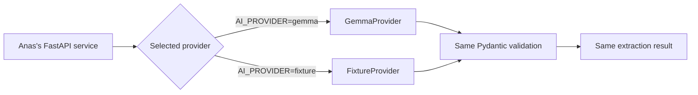
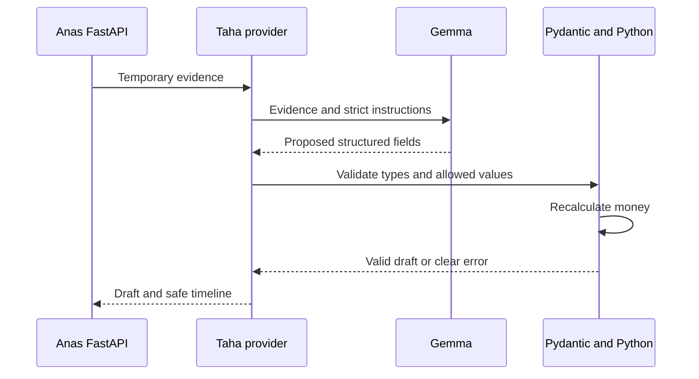

# Taha AI and procurement guide

This guide explains Taha's work in simple English.

Taha does not need to build a large autonomous agent first. His first goal is
one small, safe, testable flow:

```text
Known receipt
        ↓
Saved extraction result
        ↓
Pydantic checks every field
        ↓
Anas receives a clean draft
```

After that works, Taha replaces the saved result with a real Gemma call. Both
ways must return exactly the same data shape.

## 1. What Taha is building

Taha owns two connected parts.

### Part A: evidence understanding

Gemma reads a receipt image or a short Darija/French voice note and proposes:

- What type of transaction it found.
- Product names.
- Quantities and units.
- Prices.
- Confidence for uncertain values.
- One useful clarification question.

This result is only a **draft**. It is not official business data.

### Part B: procurement intelligence

Normal Python functions use confirmed inventory and supplier data to:

- Predict a stockout.
- Suggest a reorder quantity.
- Compare supplier offers.
- Find compatible demand from other merchants.
- Calculate collective-order savings.
- Produce the facts that Gemma can explain in simple language.

The calculations must be deterministic. This means the same inputs always give
the same result.

## 2. Who owns each part

| Person | Owns                                                                                                                                      |
| ------ | ----------------------------------------------------------------------------------------------------------------------------------------- |
| Taha   | Gemma calls, prompts, extraction validation, fixture results, stockout calculations, offer ranking, group matching, and safe explanations |
| Anas   | FastAPI routes, login checks, organization permissions, Firebase access, saving drafts, confirmation, and official records                |
| Asttr0 | Final contracts, Firebase setup, integration, CI, deployment, and demo decisions                                                          |
| Rabii  | Supplier screens, offers UI, opportunities UI, and shared components                                                                      |
| Aymen  | Demo data support, QA, recovery checks, documentation, and presentation reliability                                                       |

Taha returns values to Anas. Taha does not write business data directly to
Firebase.

## 3. Taha's five issues

Taha should work in this order:

```text
#21 Provider and saved fixture
        ↓
#22 Real Gemma extraction
        ↓
#23 Stockout forecast
        ↓
#24 Supplier comparison
        ↓
#25 Collective-order matching
```

### Issue #21: one provider contract and one saved result

Create one extraction function that the backend can call.

It has two implementations:

- `FixtureProvider`: returns the approved saved answer.
- `GemmaProvider`: calls the hosted Gemma model.

Both implementations return the same Pydantic model.

### Issue #22: real receipt and voice extraction

Make the real Gemma provider understand:

- The approved synthetic receipt.
- The approved short Darija/French voice note.

The result must match the same Pydantic model used by the fixture provider.

### Issue #23: stockout forecast

Use confirmed stock and recent sales to calculate:

- Average daily demand.
- Estimated days remaining.
- The stockout warning.
- A proposed reorder quantity.

Gemma may explain the result. Gemma must not calculate the result.

### Issue #24: supplier comparison

Compare the three approved synthetic offers using normal Python code.

The comparison must show:

- Unit price.
- Minimum order quantity.
- Delivery cost.
- Total landed cost.
- Whether the merchant can use the offer alone.
- Whether the order is affordable.
- Expected margin.
- Why an offer ranks above another offer.

### Issue #25: collective-order matching

Find other compatible demand without exposing private merchant records.

For the demo:

```text
Current merchant needs       20 units
Anonymous nearby demand      35 units
Combined order               55 units

Original unit price          22.00 MAD
Collective unit price        18.50 MAD
Product saving               70 MAD
Delivery saving              30 MAD
Total saving                100 MAD
```

## 4. What a provider means

A provider is simply a Python object that knows how to get an extraction
result.

The rest of the application calls one method:

```text
extract_evidence(input) -> extraction result
```

The caller does not need to know whether the answer came from Gemma or from a
saved file.



This is what “provider interface and fixture output” means:

- **Provider interface:** one agreed function and one agreed result shape.
- **Fixture output:** a saved, known-good answer for the demo files.

The fixture is not a second application. It is only a safe backup for the AI
step.

## 5. The contract between Taha and Anas

Anas sends temporary evidence to Taha's function.

```text
extract_evidence(
  file_bytes,
  original_name,
  content_type,
  evidence_kind,
  safe_product_context
)
```

Simple meaning:

| Input                  | Meaning                                                      |
| ---------------------- | ------------------------------------------------------------ |
| `file_bytes`           | The temporary receipt image or audio bytes                   |
| `original_name`        | The safe file name                                           |
| `content_type`         | For example `image/jpeg` or `audio/wav`                      |
| `evidence_kind`        | `receipt` or `audio` for P0                                  |
| `safe_product_context` | Approved product names and units that may help normalization |

Taha returns extracted content and execution metadata. He does not create
Firebase IDs and does not return an organization ID.

```json
{
  "provider": "fixture",
  "model": null,
  "fallback_used": false,
  "draft": {
    "transaction_kind": "purchase",
    "currency": "MAD",
    "lines": [
      {
        "product_id": "cooking_oil_1l",
        "product_name": "Cooking oil 1L",
        "unit": "bottle",
        "quantity": 20,
        "unit_price_centimes": 2200,
        "line_total_centimes": 44000,
        "confidence": 0.99,
        "uncertain_fields": []
      },
      {
        "product_id": "sugar_1kg",
        "product_name": "Sugar 1kg",
        "unit": "bag",
        "quantity": 10,
        "unit_price_centimes": 850,
        "line_total_centimes": 8500,
        "confidence": 0.64,
        "uncertain_fields": ["quantity"]
      }
    ],
    "total_centimes": 52500,
    "clarification_question": "Was the sugar quantity 10 bags?"
  },
  "timeline": [
    {
      "sequence": 1,
      "name": "extract_receipt",
      "status": "SUCCEEDED",
      "input_summary": "Synthetic receipt image",
      "output_summary": "Two draft lines; one uncertain field"
    }
  ]
}
```

Anas will:

1. Validate this result again.
2. Add ingestion and draft IDs.
3. Save it as an unconfirmed draft.
4. Wait for the user's confirmation.

## 6. Money and quantity rules

Never use a Python `float` for money.

The API and Firebase boundary uses integer centimes:

```text
18.50 MAD = 1850 centimes
22.00 MAD = 2200 centimes
```

Taha can use `Decimal` while parsing or calculating, but he must convert the
final money fields to integer centimes before returning them to Anas.

Always recalculate:

```text
line_total_centimes = quantity × unit_price_centimes
```

Do not trust a total written by Gemma. If the quantity can be fractional, use
`Decimal` and agree on the unit with Anas before changing the contract.

## 7. The safe extraction flow



The provider must never:

- Save a confirmed transaction.
- Change inventory.
- Approve an order.
- Execute a function name that is not on the allow-list.
- Trust a number only because Gemma returned it.
- Include hidden reasoning or chain-of-thought in the timeline.

## 8. Prompt rules

The extraction prompt should say:

- Extract only information that is visible or heard.
- Do not invent missing products, quantities, prices, or dates.
- Use `null` or mark a field uncertain when needed.
- Understand Darija, French, and code-switching.
- Keep the original product wording.
- Map to a standard product only when the match is strong.
- Return one short clarification question for the most important uncertainty.
- Do not confirm transactions.
- Do not change inventory.
- Do not calculate authoritative totals.
- Return only the requested structured result.

Keep prompts in files under:

```text
apps/api/app/modules/ai/prompts/
```

Do not hide important prompt changes only inside Python strings or WhatsApp
messages. Prompt changes should be reviewed like code.

## 9. Receipt rules

The approved receipt fixture expects:

| Product        |   Quantity |     Price |        Confidence |
| -------------- | ---------: | --------: | ----------------: |
| Cooking oil 1L | 20 bottles | 22.00 MAD |              High |
| Sugar 1kg      |    10 bags |  8.50 MAD | 0.64 for quantity |

Expected clarification:

> Was the sugar quantity 10 bags?

For the receipt:

- Keep the original image only in memory or a temporary file.
- Use enough image detail to read small receipt text.
- Return uncertainty instead of guessing blurry text.
- Normalize `huile 1L`, `oil 1 litre`, and the approved Darija wording to the
  same product only when the evidence is strong.
- Keep `original_product_name` if it helps explain the mapping.

## 10. Audio rules

Gemma 4 supports direct audio on the E2B, E4B, and 12B Unified model variants.
The approved audio should be short and should contain synthetic business data.

For P0:

- Keep the clip at 30 seconds or less.
- Prefer mono, 16 kHz audio.
- Ask for numbers as digits in the transcript.
- Preserve Darija/French code-switching.
- Store the transcript in the draft metadata for review.
- Mark unclear quantities or product names as uncertain.
- Never use a real merchant or customer recording.

The repository currently describes the audio fixture, but the final spoken
script and expected JSON must be frozen by Asttr0 before Taha can finish the
live audio test. Taha can start issue #21 and the receipt part of #22 now.

## 11. Real mode and backup mode

### Real mode

```text
AI_PROVIDER=gemma
```

The provider:

1. Reads the configured Gemma model name.
2. Sends the receipt or audio and strict instructions.
3. Parses the structured response.
4. Validates it with Pydantic.
5. Recalculates totals with Python.
6. Returns a safe result to Anas.

### Backup mode

```text
AI_PROVIDER=fixture
```

The provider:

1. Recognizes the approved demo evidence.
2. Loads the saved result.
3. Runs the same Pydantic validation.
4. Runs the same deterministic calculations.
5. Returns the same result shape.

### Automatic fallback

If the real call times out or returns invalid data:

```text
Try Gemma
    ↓
Validate result
    ↓
If it fails, load approved fixture
    ↓
Set fallback_used = true
    ↓
Record a safe fallback reason
```

Do not silently use a fixture for an unknown file. A fixture may only match the
approved demo evidence.

## 12. Agent and tool-call timeline

The demo needs to show what the system did.

Record useful events such as:

```text
1. inspect_evidence
2. extract_draft
3. validate_draft
4. normalize_product
5. forecast_stockout
6. compare_offers
7. calculate_collective_savings
```

Each event should contain:

| Field            | Meaning                                      |
| ---------------- | -------------------------------------------- |
| `sequence`       | Order of the event                           |
| `name`           | Approved operation name                      |
| `status`         | `STARTED`, `SUCCEEDED`, or `FAILED`          |
| `duration_ms`    | How long it took                             |
| `input_summary`  | Short safe description, not raw private data |
| `output_summary` | Short result summary                         |
| `fallback_used`  | Whether recovery mode was used               |

Do not store:

- Chain-of-thought.
- API keys.
- Raw authentication tokens.
- The complete uploaded file.
- Another merchant's sales, cash, or identity.

Function calling does not mean Gemma executes Python. Gemma may request an
approved tool. The application validates the tool name and arguments, runs the
Python function, and returns the result.

Use an explicit allow-list such as:

```text
ALLOWED_TOOLS = {
  "forecast_stockout": forecast_stockout,
  "compare_supplier_offers": compare_supplier_offers,
  "calculate_collective_savings": calculate_collective_savings
}
```

Never dynamically execute an arbitrary name returned by the model.

## 13. Stockout calculation

The stockout forecast uses quantities, not money.

Simple formula:

```text
average_daily_sales = confirmed units sold / number of observed days
days_remaining = ceil(stock_on_hand / average_daily_sales)
```

Demo example:

```text
stock_on_hand        = 14 units
average_daily_sales  = 3.5 units per day
days_remaining       = ceil(14 / 3.5)
days_remaining       = 4 days
```

The reorder uses an approved stock target:

```text
reorder_quantity =
  max(0, target_stock - stock_on_hand - incoming_stock)
```

Demo example:

```text
target_stock    = 34
stock_on_hand   = 14
incoming_stock  = 0
reorder         = 20 units
```

Special cases:

- If average daily sales are zero, do not predict a stockout.
- If sales history is too short, return `insufficient_history`.
- If stock is already zero or negative, return `out_of_stock`.
- If incoming stock covers the target, recommend zero.
- State what date range and inputs were used.

Gemma can say, “At the recent rate, this stock may last about four days.”
Gemma cannot change the calculated `4`.

## 14. Supplier comparison

First filter offers using hard rules:

- Correct product and unit.
- Supplier serves the required area.
- Requested quantity is available.
- Minimum quantity is met.
- Delivery arrives before the need date.

Then calculate:

```text
product_cost = quantity × unit_price_centimes
landed_cost = product_cost + allocated_delivery_centimes
landed_unit_cost = landed_cost / quantity
affordable = landed_cost <= available_cash_centimes
expected_unit_margin = selling_price_centimes - landed_unit_cost
```

Use this stable ranking order:

1. Eligible offers before ineligible offers.
2. Affordable offers before unaffordable offers.
3. Lower landed cost before higher landed cost.
4. Earlier delivery if costs tie.
5. Stable supplier ID if everything else ties.

The response should separate:

- `available_now`: offers the merchant can use alone.
- `group_opportunity`: a better offer that needs collective demand.
- `rejected`: offers that fail a hard rule, with the reason.

This prevents the UI from saying the 18.50 MAD offer is available for a
20-unit order when its minimum is 50.

The explanation must use the calculation result. It must not produce different
numbers.

## 15. Collective-order matching

Only combine needs when all important fields are compatible:

- Same normalized product.
- Same unit.
- Same delivery area or an approved nearby area.
- Compatible needed-by date.
- Open need status.
- Enough combined quantity to reach the supplier minimum.

The matching function should receive only the fields it needs:

```text
need_id
product_id
unit
quantity
coarse_area
needed_by
status
```

It must not receive another merchant's:

- Exact sales history.
- Profit.
- Available cash.
- Customer list.
- Full address.
- Name in merchant-facing results.

Demo calculation for the current merchant:

```text
product_saving =
  (2200 - 1850) × 20
  = 7000 centimes
  = 70 MAD

delivery_saving =
  3000 centimes
  = 30 MAD

total_saving =
  7000 + 3000
  = 10000 centimes
  = 100 MAD
```

Each merchant sees their own quantity, price, delivery share, and saving.
The supplier sees only the consolidated opportunity needed to prepare an
offer.

Joining and approving are backend actions owned by Anas. Taha only prepares
the proposal and calculations.

## 16. Recommended folders

```text
apps/api/app/modules/
  ai/
    providers/
      base.py
      fixture.py
      gemma.py
    prompts/
      receipt_extraction.md
      audio_extraction.md
      recommendation_explanation.md
    schemas/
      extraction.py
      agent_run.py
    tools/
      registry.py

  procurement/
    schemas.py
    forecasting.py
    offer_comparison.py

  group_orders/
    schemas.py
    matching.py
    savings.py

apps/api/app/tests/
  ai/
  procurement/
  group_orders/

packages/demo-data/
  receipts/
  audio/
  suppliers/
```

Simple meaning:

| File                  | Purpose                                        |
| --------------------- | ---------------------------------------------- |
| `base.py`             | The shared provider contract                   |
| `fixture.py`          | The saved demo result                          |
| `gemma.py`            | The real hosted Gemma call                     |
| `prompts/`            | Reviewed instructions sent to Gemma            |
| `schemas/`            | Pydantic models that reject bad output         |
| `registry.py`         | The allow-list of safe tools                   |
| `forecasting.py`      | Stockout and reorder calculations              |
| `offer_comparison.py` | Offer filtering, cost calculation, and ranking |
| `matching.py`         | Finds compatible anonymous demand              |
| `savings.py`          | Calculates each merchant's saving              |

Do not put all AI, calculations, and API routes in one file.

## 17. Tests Taha must write

### Provider tests

- Fixture output passes the extraction schema.
- Real and fixture providers return the same shape.
- An invalid Gemma response is rejected.
- A timeout activates the approved fixture.
- An unknown file does not receive a demo fixture.
- The fallback reason is recorded without secrets.

### Extraction tests

- The receipt returns both approved products.
- Sugar quantity confidence is `0.64`.
- The expected clarification question is returned.
- A missing price stays missing or uncertain.
- Line totals are recalculated.
- Darija/French audio returns the approved expected values.

### Forecast tests

- Demo oil returns four days and 20 units.
- Zero demand returns no false stockout.
- Negative stock returns `out_of_stock`.
- Insufficient history is reported.
- Incoming stock can reduce the reorder to zero.

### Offer tests

- All three seeded offers have a clear result.
- The MOQ 50 offer is unavailable for 20 units alone.
- The same offer becomes eligible for 55 combined units.
- An unaffordable offer cannot rank as the safe choice.
- Ties use the documented stable rule.

### Group-order tests

- `20 + 35 = 55`.
- Product saving is exactly `7000` centimes.
- Delivery saving is exactly `3000` centimes.
- Total saving is exactly `10000` centimes.
- Incompatible products or units are not combined.
- No private merchant fields appear in another merchant's result.

## 18. What Taha should do first

### Create his branch

```bash
git switch main
git pull --ff-only origin main
git switch -c feat/21-ai-provider-fixture
```

### First small delivery

1. Read this guide and issue #21.
2. Create the `ExtractionProvider` contract.
3. Create the Pydantic extraction schemas.
4. Add the exact saved receipt result from this guide.
5. Implement `FixtureProvider`.
6. Add provider and schema tests.
7. Show Anas how to call the single extraction function.
8. Open a draft pull request linked to issue #21.

This first delivery does not need:

- A Gemma API key.
- Firebase.
- FastAPI routes.
- A dashboard.
- A complete autonomous agent loop.

### Second delivery

After the fixture contract is accepted:

1. Create `GemmaProvider`.
2. Load the model name and API key from environment variables.
3. Send the approved receipt.
4. Parse and validate the response.
5. Add timeout and fixture fallback.
6. Freeze the audio script and expected result with Asttr0.
7. Test the approved audio.
8. Complete issue #22.

### Later deliveries

Build one deterministic function at a time:

```text
#23 forecast and tests
#24 offer comparison and tests
#25 group matching, savings, and privacy tests
```

Anas can connect each function to an API route after its contract is stable.

## 19. When Taha should ask the team

Taha should ask instead of guessing when:

- The approved receipt or audio changes.
- The audio script or expected output is missing.
- A draft field is missing from the API contract.
- A product unit is unclear.
- A reorder policy is unclear.
- Supplier offer values are not frozen.
- Available cash or margin rules are unclear.
- Two merchant needs have different delivery areas or dates.
- The configured hosted model does not support the required input.

Record final answers in GitHub issue #12, #21, #22, #23, #24, or #25.

## 20. Official Gemma references

These are the current official references for Taha's work:

- [Run Gemma with the Gemini API](https://ai.google.dev/gemma/docs/core/gemma_on_gemini_api)
- [Gemma 4 model overview](https://ai.google.dev/gemma/docs/core)
- [Gemma vision understanding](https://ai.google.dev/gemma/docs/capabilities/vision)
- [Gemma audio understanding](https://ai.google.dev/gemma/docs/capabilities/audio)
- [Gemma 4 function calling](https://ai.google.dev/gemma/docs/capabilities/text/function-calling-gemma4)

Important rule from the function-calling workflow: the model proposes a tool
call, but the application validates and executes the Python function.
